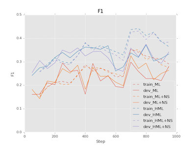

# Convolutional Neural Network for Relation Extraction

**Note:** This project is mostly based on https://github.com/yuhaozhang/sentence-convnet

---


## Requirements

- [Python 2.7](https://www.python.org/)
- [Tensorflow](https://www.tensorflow.org/) (tested with version 0.10.0rc0)
- [Numpy](http://www.numpy.org/)
- [Scipy](http://www.scipy.org/)


[//]: # "To visualize the results (`visualize.ipynb`)"

[//]: # "- [Pandas](http://pandas.pydata.org/)"
[//]: # "- [Matplotlib](matplotlib.org)"
[//]: # "- [Scikit-learn](http://scikit-learn.org/)"


## Data
- We used Penn Discourse Treebank ver. 2.0.  
    Assume that CoNLL 2016 data is stored in json format under `data/conll` dir.
    ```
    cnn-al-tf
    ├── ...
    ├── word2vec
    └── data
        └── conll
            ├── pdtb-dev.json
            ├── pdtb-dev-parses.json
            ├── pdtb-train.json
            └── pdtb-train-parses.json
    ```
    
- `word2vec` directory is empty. Please download the Google News pretrained vector data from 
[this Google Drive link](https://drive.google.com/file/d/0B7XkCwpI5KDYNlNUTTlSS21pQmM/edit), 
and unzip it to the directory. It will be a `.bin` file.


## Usage
### Preprocess

```sh
python ./util.py
```
It creates `vocab.txt`, `*.ids` and `emb.npy` files.

### Training


- Hierarchical Multi-label classification with negative sampling (HML+NEG):
    ```sh
    python ./train.py --sent_len=163 --vocab_size=34368 --num_classes=21 \
    --hierarchical=True --negative=True --use_pretrain=True
    ```
    
- Hierarchical Multi-label classification on split contexts with negative sampling (HML+CONT+NEG):
    ```sh
    python ./train_split.py --sent_len=100 --vocab_size=34368 --num_classes=21 \
    --hierarchical=True --negative=True --use_pretrain=True
    ```

**Caution:** A wrong value for input-data-dependent options (`sent_len`, `vocab_size` and `num_classes`) 
may cause an error. If you want to train the model on another dataset, please check these values.


### Evaluation

```sh
python ./eval.py --train_dir=./train/1473898241
```
Replace the `--train_dir` with the output from the training.


### Run TensorBoard

```sh
tensorboard --logdir=./train/1473898241
```


[//]: # "## Architecture"

[//]: # ""


[//]: # "## Results"

[//]: # "|       |  P |  R |  F |AUC |"
[//]: # "|:------|:--:|:--:|:--:|:--:|"
[//]: # "|ML+NEG |0.93|0.89|0.91|0.92|"
[//]: # "|ML+CONT|0.79|0.65|0.71|0.73|"
[//]: # "|ML+CONT+NEG|0.82|0.75|0.78|0.79|"

[//]: # ""


## References

* http://github.com/yuhaozhang/sentence-convnet
* http://github.com/dennybritz/cnn-text-classification-tf
* http://www.wildml.com/2015/12/implementing-a-cnn-for-text-classification-in-tensorflow/
* http://tkengo.github.io/blog/2016/03/14/text-classification-by-cnn/
* Mihaylov and Frank. [Discourse Relation Sense Classification Using Cross-argument Semantic Similarity Based on Word Embeddings](https://aclweb.org/anthology/K/K16/K16-2014.pdf) ACL 2016
* Nguyen and Grishman. [Relation Extraction: Perspective from Convolutional Neural Networks](http://www.cs.nyu.edu/~thien/pubs/vector15.pdf) NAACL 2015
* Zhang and Wallace. [Active Discriminative Word Embedding Learning](https://arxiv.org/pdf/1606.04212v1.pdf) arXiv:1606.04212
